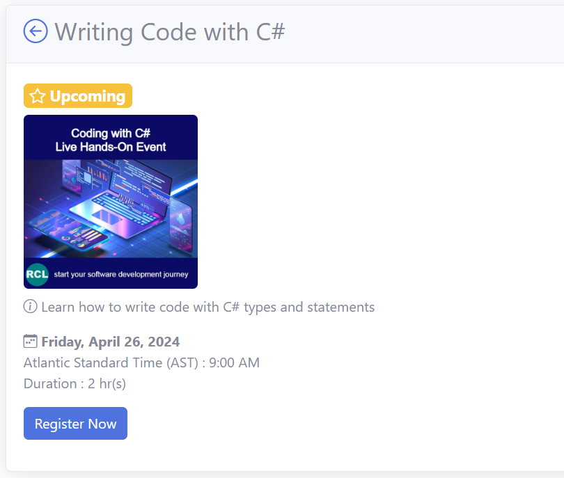
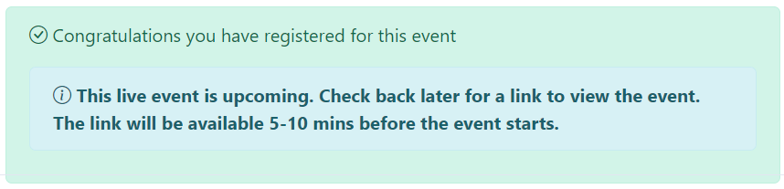
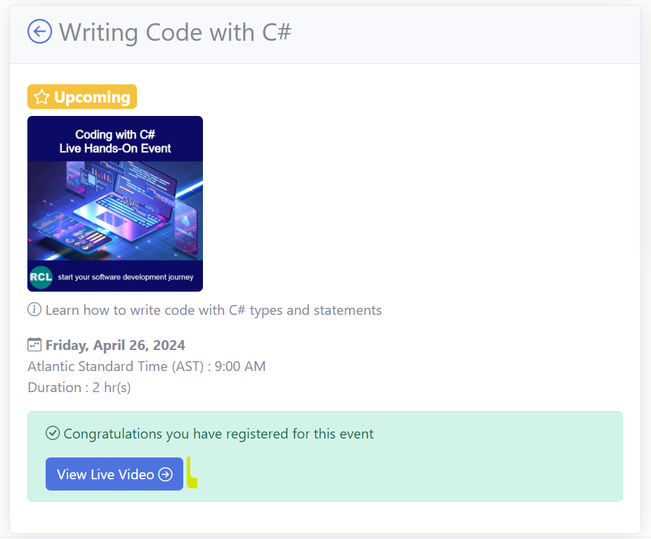
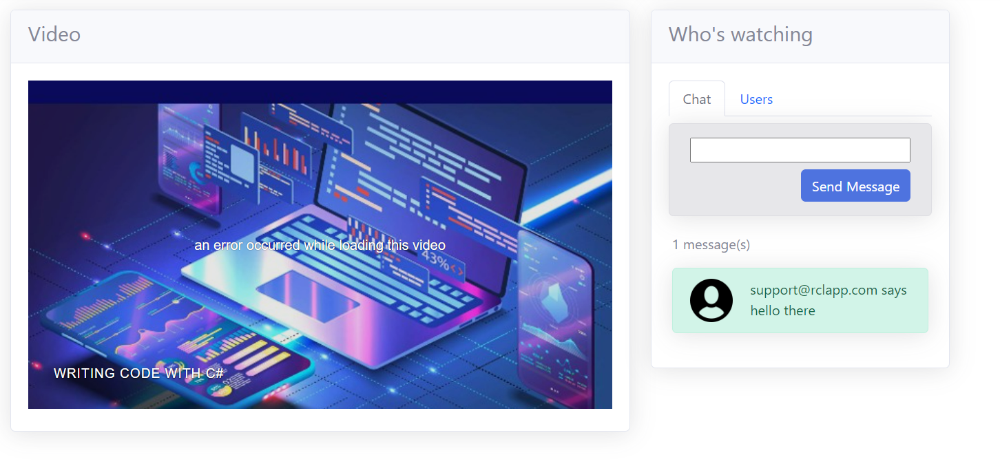

# Events

Events are conducted on a scheduled basis. The events are delivered on-line through live video and chat. Some events are recorded and can be played back on-demand. Events are of two types:

## Hands-On Workshops

Demonstrations of practical activities. This is done on the main website.

## Discussion Sessions

Question and Answer sessions and general discussions. This is normally done with Microsoft Teams Meeting.

# Register for an Event

{: .information }
You must have a valid [Subscription]() to register for an event. 

 - [Register](../identity/identity.md) and [Subscribe](../subscription/manage.md) to RCL CloudTnT if you have not done so already

 - Login and navigate to the `Event Details` page

 - Click on the ``Register Now`` link

 - Upon successful registration you will see this message.

# Viewing a Live Event

A link button will be provided 5-10 mins before the live video event starts.

Click on the link button to view the live stream.

- In the ``Video`` page, you can view the live event and chat with other users and presenters

