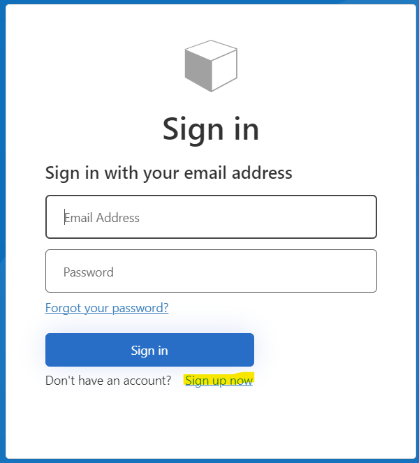
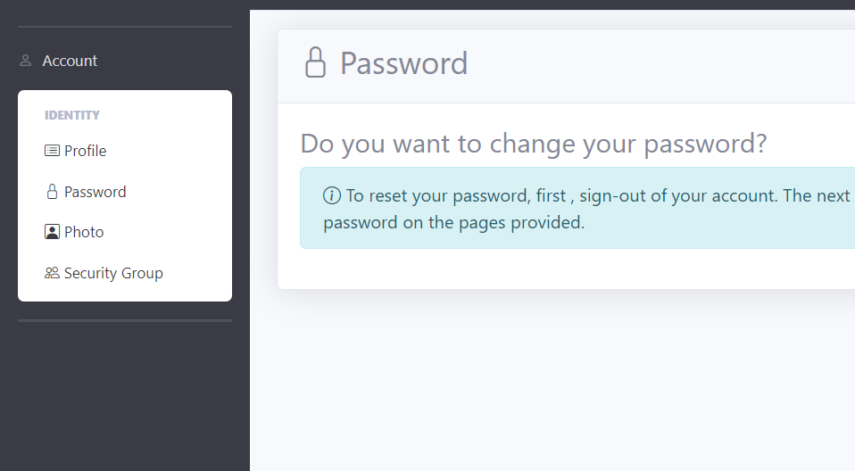
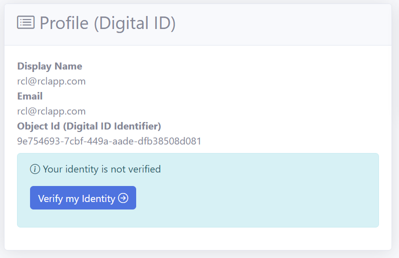
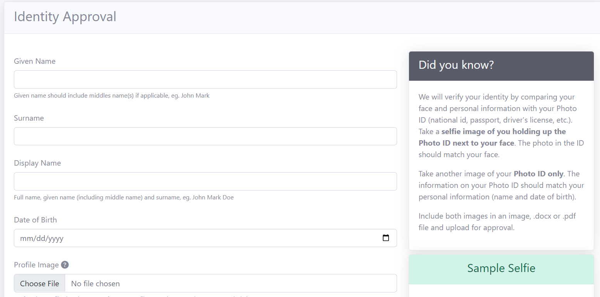
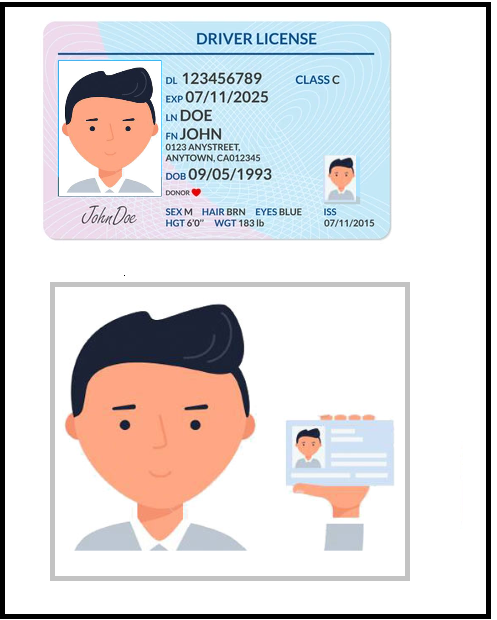
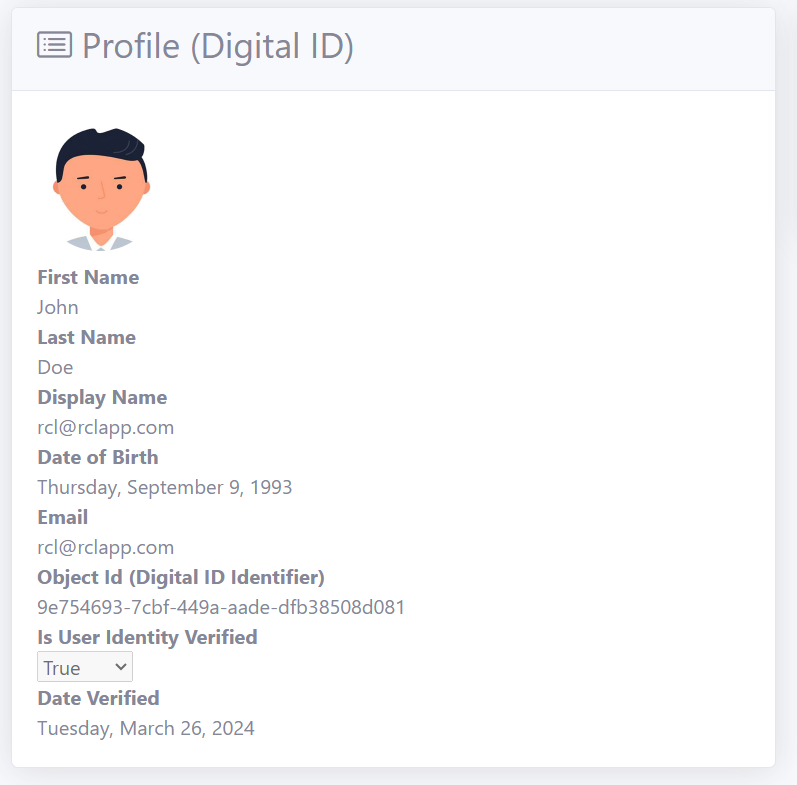

# Identity

You must register and login to use many features of RCL CloudTnT. In addition, you may be required to verify your identify for certain features.

# Register

- Click the ``Login`` link at the top of the page

- In the ``Sign in`` page , click the ``Sign up now`` link at the bottom of the page

- Verify your email address and set your password

# Managing your Identity

You can manage your identity with the login drop down at the top of the page

You can also manage your identity in the Portal in the ``Account`` section

# Verified Identity

We will verify your identity by using an official Photo ID issued to you. Photo IDs may include

- National Identification Card
- Driver's Permit
- Passport

## Verification Process

- In the ``Profile`` page, click on the ``Verify my Identity`` button

- In the ``Identity Approval`` page, add your personal details        

- You are required to upload a photo for your profile. The photo should be 250 x 250 px and must not be more that 250 Kb in size.

- You should take a photo of the Photo ID alone, clearly showing your name and date of birth

- You should take a selfie with you holding up the Photo ID next to your face. The face in the ID should match your face.

- Include both photos in a .docx, .pdf or image file and upload for verification

- Click the ``Submit`` button when you are done

- Recheck your data and image files and click the ``Submit for approval`` button

- You identity should be verified with 10 days. If you do not get a reply, please contact support

- Your verified identity can be found in the ``Profile`` page

