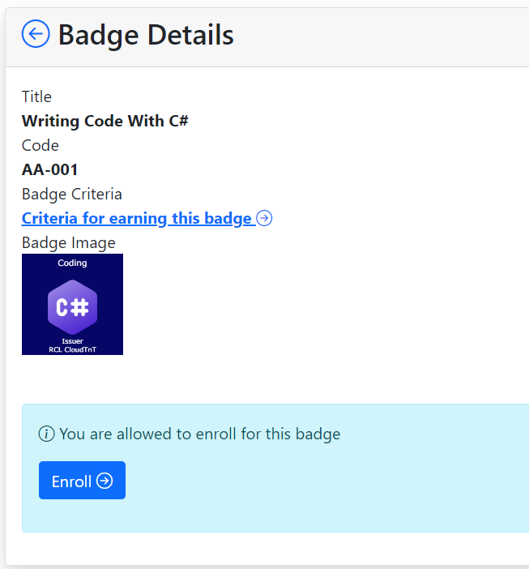
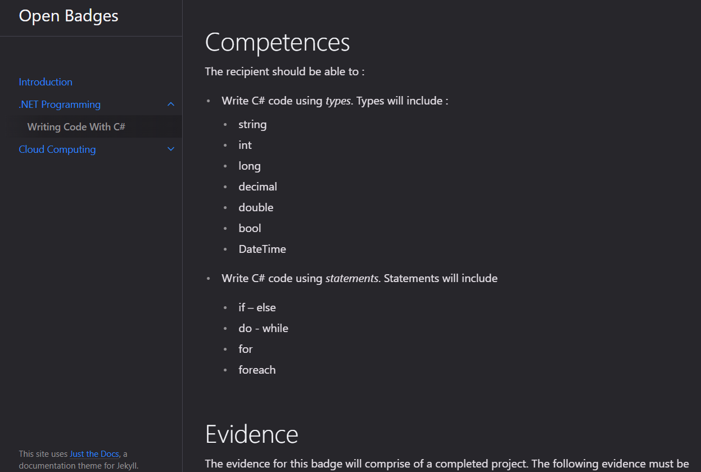
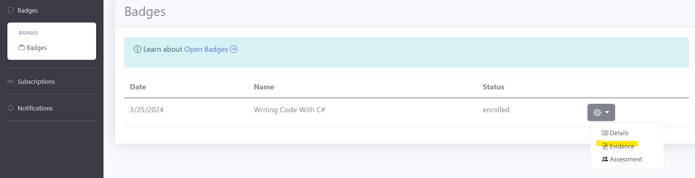
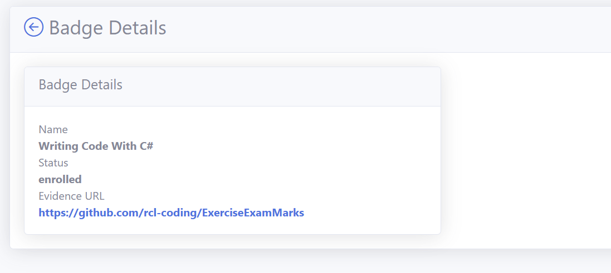
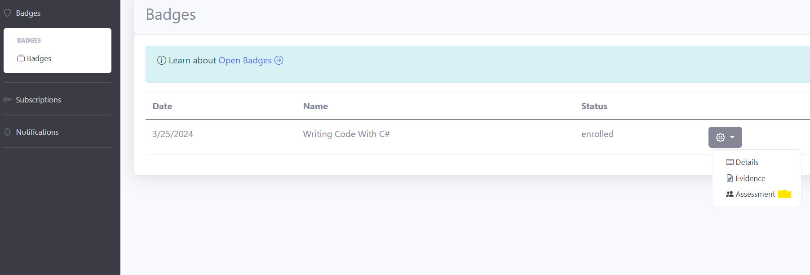
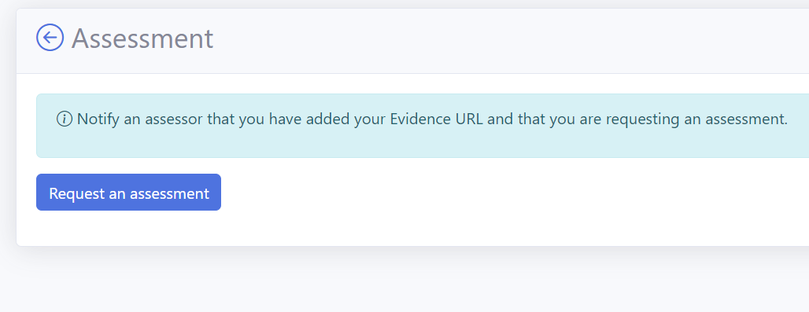

# Earn an Open Badge

To earn an Open Badge, you must demonstrate that you have satisfied the criteria for the Open Badge.

## Criteria for Badge

Each badge has a criteria that must be met to earn the badge. To read the criteria, navigate to the ``Badge Details`` page and click on the ``Criteria for earning ths badge`` link

 

 The criteria will specify :

 - What competences are required to earn the badge
 - What evidence must be produced
 - How you will be assessed

  

## Evidence

You must submit evidence of your work to earn a badge. This evidence may include one or more of the following:

- a GitHub project containing your software development work
- a GitHub public page containing screen shots and descriptions of work you have completed personally , for you employer or a customer

In the Portal, you will add your add you evidence in the ``Badge Evidence`` page

Insert a link to your GitHub project or page that you are supplying as evidence

You can check that the link works in the ``Badge Details`` page in the Portal

## Requesting an Assessment

{: .information }
You must submit evidence for a badge before you schedule and assessment.

Once you have added your evidence, you must first ensure that the evidence is sufficient to meet the criteria for the badge.

The next step is to request an assessment in the Portal.

- Navigate to the ``Assessment`` page

- Click the link to request an assessment

- Once an assessment is requested, you will not be able to edit your evidence URL.

## Assessment

An assessment will be conducted by a assessor to verify that your evidence and competence is adequate to meet the criteria for the badge. The assessment may be conducted on none of more of the following methods.

### Online On-on-One Meeting

The assessor will schedule and conduct a one-on-one live meeting with your. This will be done via Microsoft Teams Meeting. During the meeting the assessor will interview you on your projects and the evidence you provided.

### Online Observation of Performance

The assessor will ask you to share your screen and perform various tasks to demonstrate your competence.

### Review of your Evidence

The assessor will conduct an offline review of your projects and evidence that you provided for your badge.

## Outcome of Assessment

### Competent

If the assessor has made a judgement that you have met the criteria. The status of your badge will change to ``issued``. You will then be issued a badge.

### Not-Yet-Competent

If you are not yet competent, the status of your badge will be set to ``resubmit``. You may need to resubmit more evidence and under go follow up assessments. You will need to request a new assessment in the Portal when you are ready. You may under 2 or more assessments based on the judgement of your assessor.

