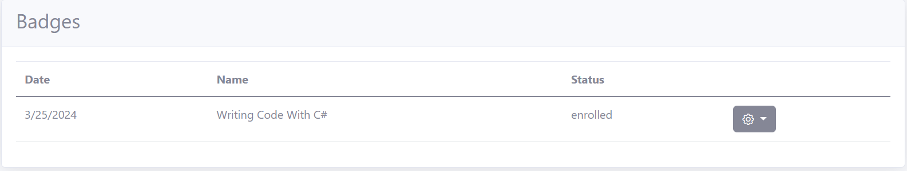

# Enrolling for a Badge

{: .information }
You must have a valid [Subscription](../subscription/manage.md) and a [Verified Digital ID](../identity/identity.md#verified-identity) to enroll for a badge. Once you have met both these requirements, you will be allowed to enroll for a badge

 - [Register](../identity/identity.md) and [Subscribe](../subscription/manage.md) to RCL CloudTnT if you have not done so already

 - Obtain a [Verified Digital ID](../identity/identity.md#verified-identity) if you have not done so already

 - Login and navigate to the ``Badge Details`` page

 - Click on the ``Enroll`` button

 

 - In the Portal, you can manage all your enrolled badges

  
