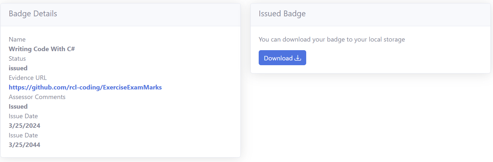
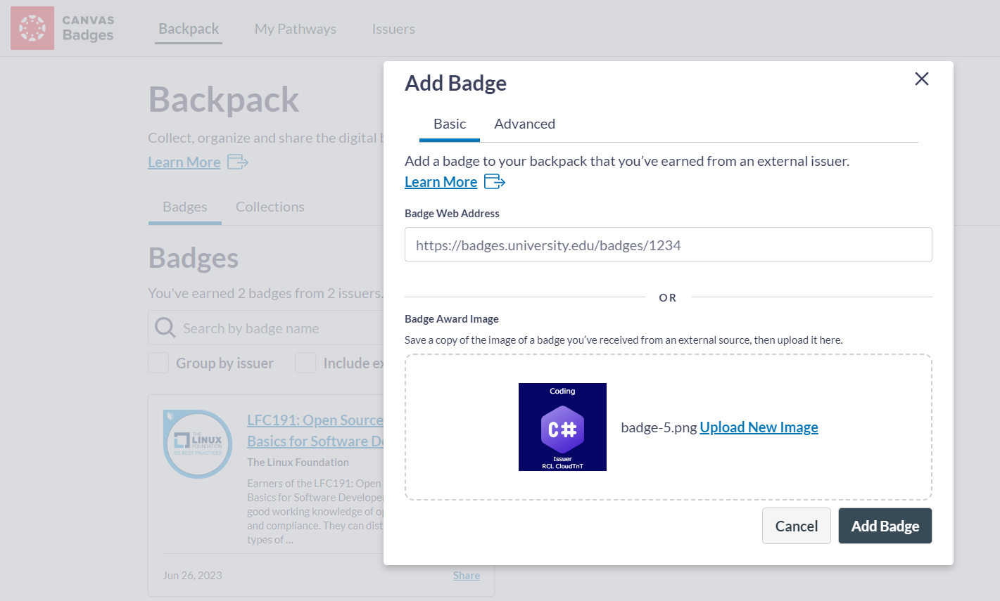
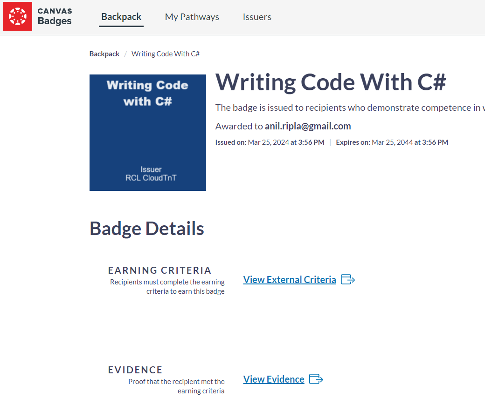
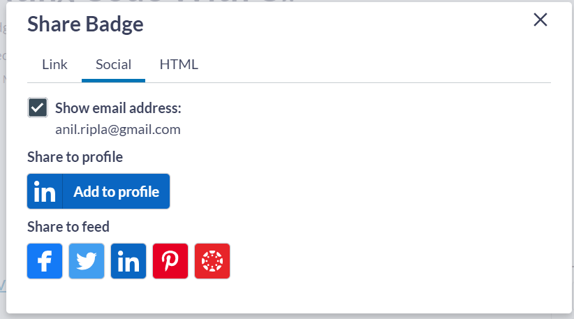

# Badge Issuance

Once you have satisfied the criteria for a badge, it will be issued to you by your assessor.

## Badge File

The badge is a .PNG image file with embedded metadata. The metadata will be "baked" into the badge. If you were to inspect the metadata of the badge you will notice the key word ``openbadges`` with a JSON string value. he following is a sample of the value:

```json
{
    "@context": "https://w3id.org/openbadges/v2",
    "id": "https://rcl-cloudtnt.github.io/badges/assertions/93b1a877-d82a-4e55-9105-cf0fa3ad966e.json",
    "type": "Assertion",
    "recipient": {
        "identity": "sha256$f351b6056259f8104587d593b74d1cadb9c41dddadb8751c2c2b7c2ea30c6afd",
        "type": "email",
        "hashed": true
    },
    "issuedOn": "2024-03-24T04:00:00.0000000Z",
    "verification": {
        "type": "HostedBadge"
    },
    "badge": {
        "type": "BadgeClass",
        "id": "https://rcl-cloudtnt.github.io/badges/netProgramming/badgeClass/writing-code-with-csharp.json",
        "name": "Writing Code With C#",
        "description": "The badge is issued to recipients who demonstrate competence in writing code with C#.",
        "image": "https://rcl-cloudtnt.github.io/badges/netProgramming/badgeClass/writing-code-with-csharp.png",
        "criteria": "https://rcl-cloudtnt.github.io/badges/netProgramming/writing-code-with-csharp.html",
        "issuer": {
            "id": "https://rcl-cloudtnt.github.io/badges/issuer/profile.json",
            "type": "Issuer",
            "name": "RCL CloudTnT",
            "url": "https://rcl-cloudtnt.github.io/badges",
            "image": "https://rcl-cloudtnt.github.io/badges/issuer/image.png",
            "publicKey": "https://rcl-cloudtnt.github.io/badges/issuer/publicKey.json"
        }
    },
    "expires": "2044-03-24T04:00:00.0000000Z",
    "evidence": "https://rcl-cloudtnt.github.io/badges/netProgramming/writing-code-with-csharp.html"
}
```

The JSON structure contains the following objects

## Assertion

This provides details of when the issued badge. It specifies the issuance and expiry dates as weill as the evidence URL. The assertion further comprises:

### Recipient

The user the badge was issued to. The user is uniquely identified by an email address. The email address is hashed to protect the privacy of the recipient.

{: .information }
It is important that the email you registered to use RCL Cloud TnT must be the same email you use to register for you external backpack. Your email is the linking field that connects your backpack.

### Badge

This object provides details about the badge name, image, description and criterial URL. The badge object also comprise:

### Issuer

This object provides details of the organization that issued the badge

## Hosting the Badge

The Badge is hosted online. This us specified in the ``verification`` object of the assertion. RCL Cloud TnT hosts badge assertions and it reliant links on GitHub.

{: .information }
A user's badge assertion is hosted on GitHub which is a highly available online system for accessing web-hosted files. It is a stable organization which ensures the longevity of your badge on the online badging eco-system. The assertion contains no personal identifiable data and there protects your privacy.

## Downloading a Badge

You can download a badge in the Portal in the ``Badge Details`` page. The download link will only appear when the badge is officially issued to you.



You can save you badge in you local computer and share with anyone.

## Backpack

A Backpack is an application that meets the specification for storing Open Badges online. You can upload your badge to a backpack where you can manage all your badges issued by RCL Cloud TnT and the other badge issuers that exists in the ecosystem. 

The following are some of the most popular backpacks:

 - [Badgr](badgr.com)
 - [Open Badge Passport](https://openbadgepassport.com)
 - [Credly](https://info.credly.com/badge-earner-support)

### Badgr

 Badgr offers a free backpack for storing and sharing badges.

 - In Badgr, upload you badge and click the ``Add Badge`` button



- You can now manage your badges in Badgr



- Badgr allows you to share your badge across the internet, in social media sites and html embedding



### Collections

One of the powerful features of badges is that they are "stackable". You can create you own collections of badges you earn based on your learning path or career objectives. You can share your entire collection online.