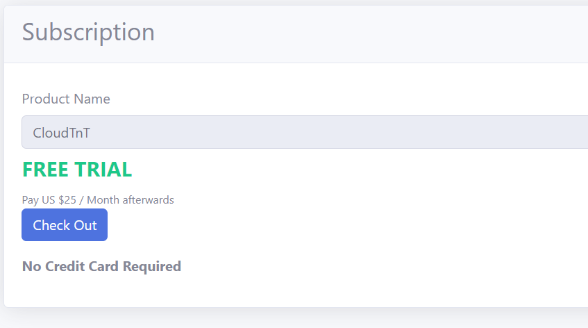
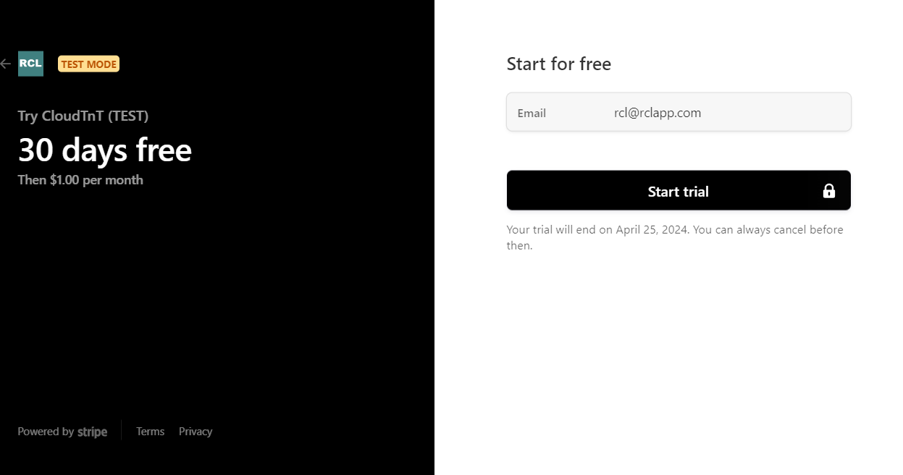
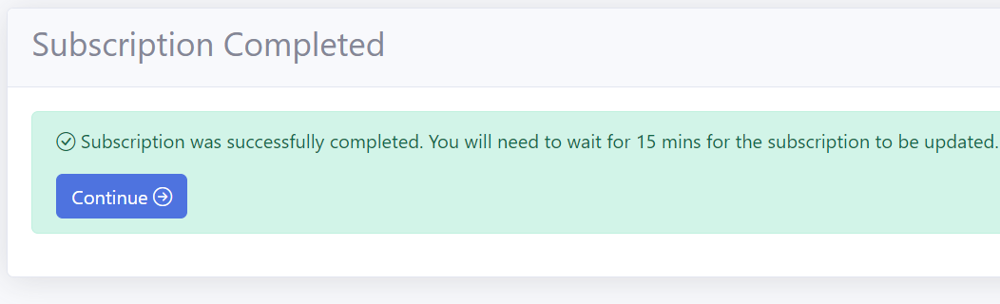
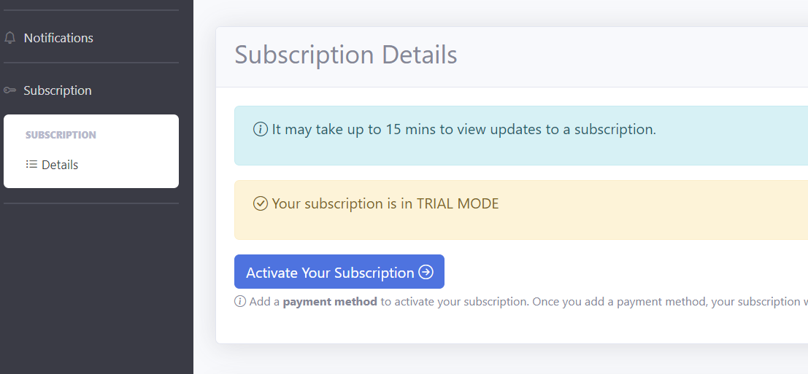
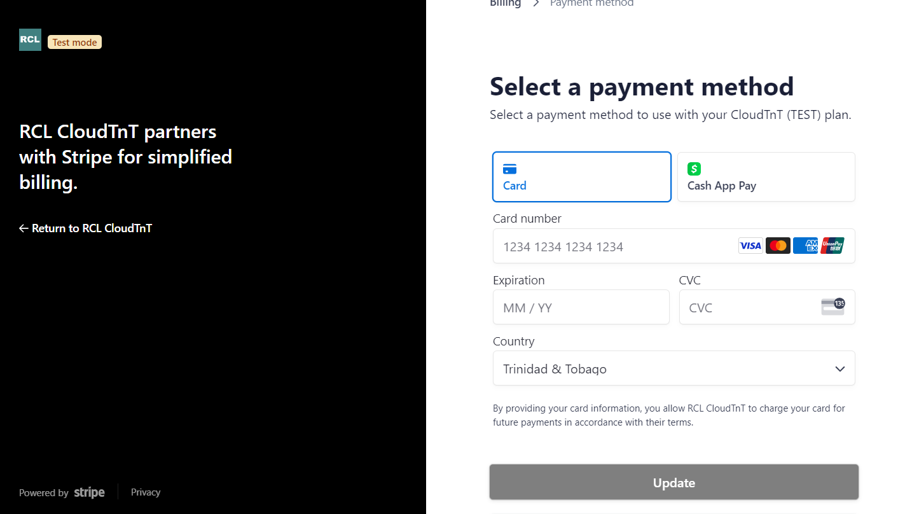
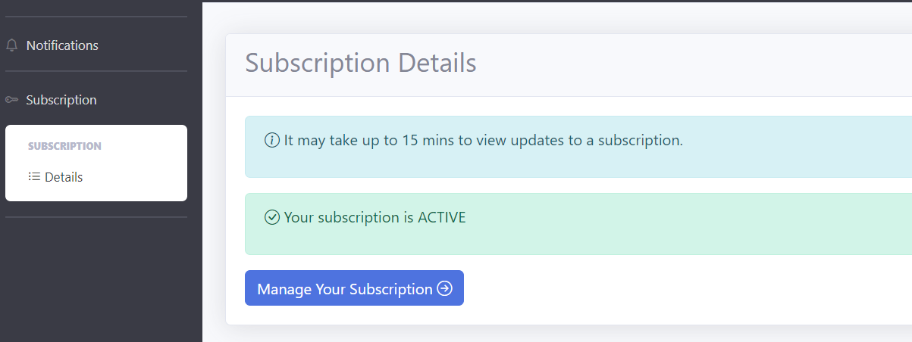
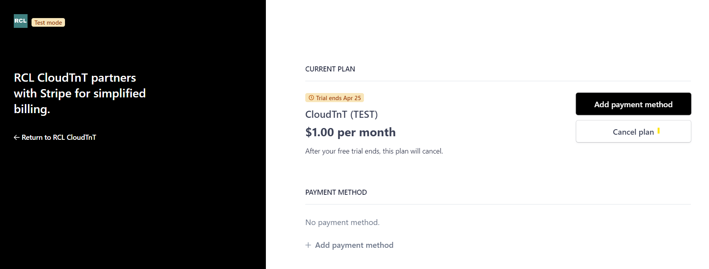
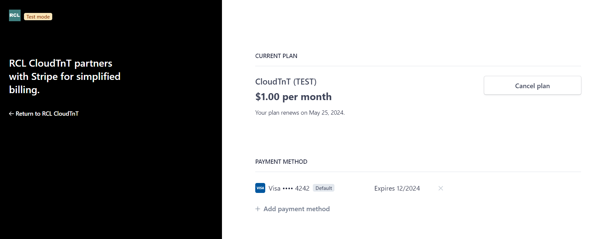
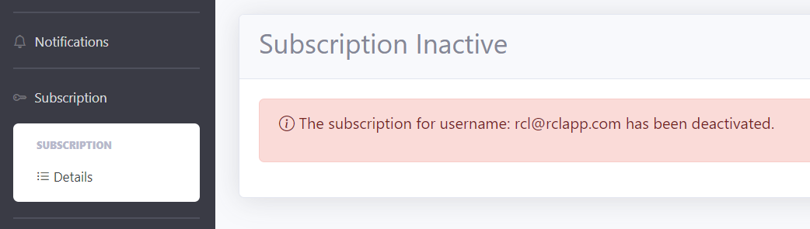

# Subscription

Follow these steps to subscribe to RCL Cloud TnT

- Click on the ``Subscribe`` button

- On the ``Subscription`` page, click the ``Checkout`` button

- Click the Start trial button

{: .information }
A Credit Card is not required to create a free trial subscription to RCL Cloud TnT

- You will need to wait for up 15 mins for your subscription to be processed

- Click the ``Continue`` link to proceed

# Activating a Trial Subscription

You will be required to activate a trial subscription before it expires in 30 days.

{: .information }
Your Credit Card payment and Credit Card information is managed solely by [Stripe](https://stripe.com/).

- In the Portal, navigate to the ``Subscription Details`` page

- Click the ``Activate Your Subscription Page``

- Click on the ``Manage your subscription`` button

- In the ``Stripe`` billing page, click on the ``Add payment method`` button

- Add your credit card number and information

- Click the ``Update`` button when you are done

- When the trial ends, the subscription will be automatically activated

- You can check your activated subscription in the Portal

# Cancel a Trial Subscription

- In the Portal, navigate to the ``Subscription Details`` page

- Click the ``Activate Your Subscription Page``

- Click on the ``Manage your subscription`` button

- In the ``Stripe`` billing page, click on the ``Cancel`` plan button

- After the trial ends, the subscription will be cancelled

# Cancel a Subscription

- In the Portal, navigate to the ``Subscription Details`` page

- Click the ``Activate Your Subscription Page``

- Click on the ``Manage your subscription`` button

- In the ``Stripe`` billing page, click on the ``Cancel plan`` button

- Confirm the cancellation and add a reason

- The subscription will be cancelled at the end of the subscription cycle for the month

- Your subscription will be deactivated when in becomes cancelled

{: .warning }
A cancelled subscription cannot be reversed. All you data is the application will be deleted. Please download any Open Badges you have before you cancel your subscription.